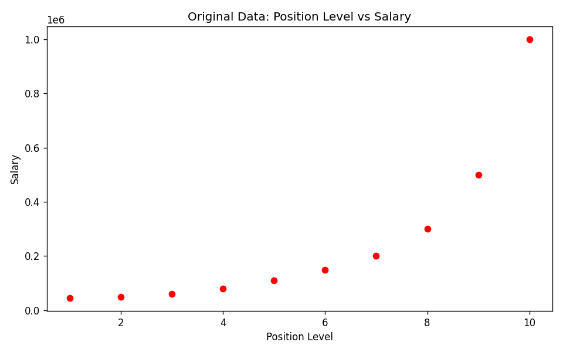
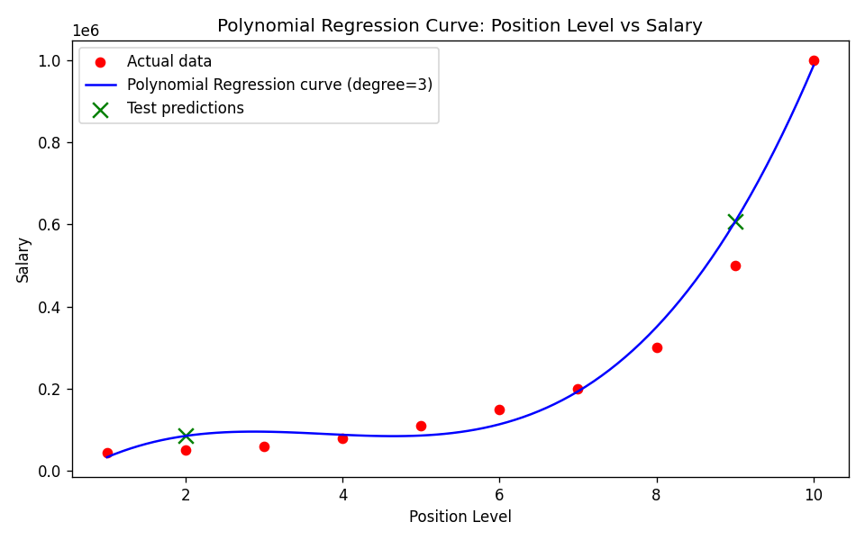

# Assignment 3: Position Salary Prediction using Polynomial Regression

## 🎯 Objective

A company wants to estimate the salary of employees based on their position level. Since the relationship between position level and salary is **non-linear**, this project develops a **Polynomial Regression** model to predict employee salaries from position level.

## 📊 Dataset

**Position Salaries Dataset**

- **Kaggle Link:** https://www.kaggle.com/datasets/akram24/position-salaries
- **Size:** 10 rows × 3 columns
- **Target Variable:** `Salary`

> ⚠️ The dataset is **not** included in this repository due to licensing restrictions. Download `Position_Salaries.csv` from the Kaggle link above and place it in the same folder as the notebook before running it.

## 📚 Libraries Used

| Library | Purpose |
|---|---|
| pandas | Data loading and manipulation |
| numpy | Numerical operations |
| matplotlib | Visualization (scatter plot, regression curve) |
| scikit-learn | `PolynomialFeatures`, `LinearRegression`, train/test split, evaluation metrics |

## 🔬 Methodology

1. **Data Understanding** — Loaded the dataset with Pandas, displayed the first five records, identified `Level` as the input feature and `Salary` as the target variable (`Position` is a redundant text label for `Level`), and reviewed dataset info and summary statistics.
2. **Data Preprocessing** — Checked for missing values (none found), selected `Level` as `X` and `Salary` as `y`, and split the data into **80% training / 20% testing**.
3. **Model Development** — Transformed `Level` into polynomial features of **degree 3** using `PolynomialFeatures`, trained a `LinearRegression` model on the transformed features (i.e. Polynomial Regression), and predicted salaries on the test set.
4. **Model Evaluation** — Evaluated with MAE, MSE, and R² Score, and visualized results with two plots: a scatter plot of the original data, and the fitted polynomial regression curve overlaid on the data.

## 📈 Results

| Metric | Value |
|---|---|
| **MAE (Mean Absolute Error)** | ≈ 70,635.25 |
| **MSE (Mean Squared Error)** | ≈ 6,263,853,282.86 |
| **R² Score** | ≈ 0.8763 |

**Scatter plot of the original data:**



**Polynomial Regression curve fitted to the data:**



**Key observations:**

- An R² of ≈ 0.88 means the model explains most of the variance in salary from position level, and the curve visibly tracks the steep, non-linear jump at senior levels (Partner → CEO) — something a linear model would badly underestimate.
- MAE (≈ 70,635) and MSE look large in absolute terms, but salaries here range up to 1,000,000, and the model is extrapolating from only 8 training points — so the errors are reasonable relative to that scale.
- With only 10 rows total, the 80/20 split leaves just 2 test points, so these metrics are indicative rather than statistically robust — a different random split could shift them noticeably. The very close fit on training data is typical of polynomial regression on small datasets and carries some risk of overfitting.

## 🏁 Conclusion

This project applied Polynomial Regression (degree 3) to predict employee salary from position level. The dataset shows salary rising slowly at junior levels and then sharply at senior levels (Partner through CEO), a curve a straight line cannot follow. Fitting a cubic polynomial let the model trace this trend closely, and the evaluation metrics (MAE, MSE, R² ≈ 0.88) confirm a strong fit, though the tiny sample size (10 rows) limits confidence in the test-set numbers.

**Linear vs. Polynomial Regression:** Linear Regression fits one straight line and assumes a constant rate of change. Polynomial Regression fits a curve by adding higher-degree terms of the same feature, letting it bend to follow non-linear trends.

**Advantage here:** Polynomial Regression captures the accelerating salary growth at senior levels, giving far more accurate predictions than a linear model, which would underfit both ends of the position scale.

## 📁 Repository Structure

```
Assignment 3/
├── Assignment-3.ipynb          # Complete notebook (Tasks 1–5, with outputs)
├── scatter_original_data.png   # Scatter plot of the original data
├── polynomial_regression_plot.png  # Polynomial regression curve
└── README.md                   # This file
```

## ▶️ How to Run

1. Download the dataset from [Kaggle](https://www.kaggle.com/datasets/akram24/position-salaries) and place `Position_Salaries.csv` next to the notebook.
2. Install dependencies: `pip install pandas numpy matplotlib scikit-learn`
3. Open and run `Assignment-3.ipynb` in Jupyter.

---

*Submitted by: Ayush (23MIP10135), VIT Bhopal*
