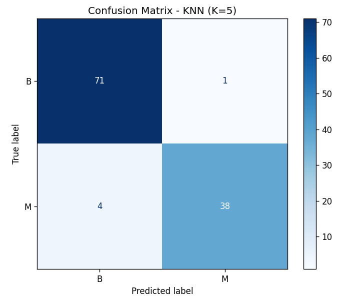

# Assignment 4: Breast Cancer Diagnosis Prediction using K-Nearest Neighbors

## Objective

A healthcare organization wants to predict whether a breast tumor is **Malignant (M)** or **Benign (B)** based on diagnostic measurements taken from digitized images of breast masses. This project develops a **K-Nearest Neighbors (KNN)** classification model to classify tumors accurately.

## Dataset

**Breast Cancer Wisconsin (Diagnostic) Dataset**

- **Kaggle Link:** https://www.kaggle.com/datasets/uciml/breast-cancer-wisconsin-data
- **Size:** 569 rows × 30 numerical features (after dropping `id` and the empty `Unnamed: 32` artifact column)
- **Target Variable:** `diagnosis` (`M` = Malignant, `B` = Benign)

> The dataset is **not** included in this repository due to licensing restrictions. Download `data.csv` from the Kaggle link above and place it in the same folder as the notebook before running it.

## Libraries Used

| Library | Purpose |
|---|---|
| pandas | Data loading and manipulation |
| numpy | Numerical operations |
| matplotlib | Visualization (confusion matrix) |
| scikit-learn | `StandardScaler`, `LabelEncoder`, `KNeighborsClassifier`, train/test split, evaluation metrics |

## Methodology

1. **Data Understanding** — Loaded the dataset with Pandas, displayed the first five records, identified the 30 numerical diagnostic features and `diagnosis` as the target variable, and reviewed dataset info and summary statistics.
2. **Data Preprocessing** —
   - Checked for missing values — found the `Unnamed: 32` column is entirely empty (a CSV export artifact) and dropped it, along with the non-predictive `id` column.
   - Encoded the target variable with `LabelEncoder` (`B` → 0, `M` → 1).
   - Standardized all 30 numerical features with `StandardScaler`, fit only on the training data to avoid leakage.
   - Split the data into **80% training / 20% testing** (stratified on the target).
3. **Model Development** — Trained a `KNeighborsClassifier` with **K = 5** on the scaled training features and predicted diagnoses on the test set.
4. **Model Evaluation** — Evaluated with Accuracy, Precision, Recall, F1-Score, and a Confusion Matrix.

## Results

| Metric | Score |
|---|---|
| **Accuracy** | 95.61% |
| **Precision (Malignant)** | 0.9744 |
| **Recall (Malignant)** | 0.9048 |
| **F1-Score (Malignant)** | 0.9383 |

**Confusion Matrix (test set, n = 114):**

| | Predicted: Benign | Predicted: Malignant |
|---|---|---|
| **Actual: Benign** | 71 (TN) | 1 (FP) |
| **Actual: Malignant** | 4 (FN) | 38 (TP) |



**Key observations:**

- The model achieves strong overall accuracy (~96%), showing that tumor diagnosis can be predicted reliably from the scaled diagnostic measurements alone using a simple distance-based classifier.
- Precision on the Malignant class (~0.97) is higher than recall (~0.90) — the model misses a few malignant cases (4 false negatives) more often than it wrongly flags a benign one (1 false positive). In a medical screening context, false negatives are the costlier error, so recall is the metric worth focusing on when tuning further.
- Feature scaling was essential here: since KNN classifies based on distance, unscaled features like `area_mean` (values in the hundreds/thousands) would otherwise dominate the distance calculation over features like `smoothness_mean` (values near 0), regardless of how informative each feature actually is.

## Conclusion

This project applied a K-Nearest Neighbors (K = 5) classifier to distinguish malignant from benign breast tumors using 30 diagnostic measurements from the Breast Cancer Wisconsin dataset. After encoding the target and standardizing all features, the model achieved strong accuracy, precision, recall, and F1-scores on the held-out test set, showing that nucleus-shape measurements carry a clear diagnostic signal.

Feature scaling was essential for KNN, since it classifies based on distance between points, and unscaled features on larger numeric ranges (like area) would otherwise dominate the distance metric over smaller-scale features (like smoothness), regardless of their actual predictive value.

A key limitation of KNN is that it stores the entire training set and computes distances at prediction time, making it computationally slow and memory-heavy on large datasets; it is also sensitive to irrelevant features and the choice of K.

## Repository Structure

```
Assignment 4/
├── Assignment-4.ipynb     # Complete notebook (Tasks 1–5, with outputs)
├── confusion_matrix.png   # Confusion matrix plot
└── README.md              # This file
```

## How to Run

1. Download the dataset from [Kaggle](https://www.kaggle.com/datasets/uciml/breast-cancer-wisconsin-data) and place `data.csv` next to the notebook.
2. Install dependencies: `pip install pandas numpy matplotlib scikit-learn`
3. Open and run `Assignment-4.ipynb` in Jupyter.

---

*Submitted by: Ayush (23MIP10135), VIT Bhopal*
