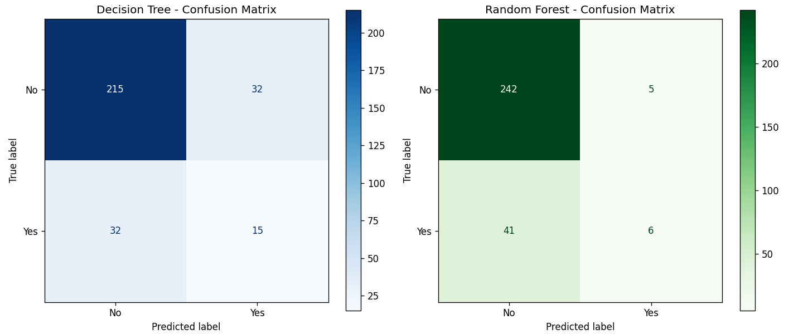
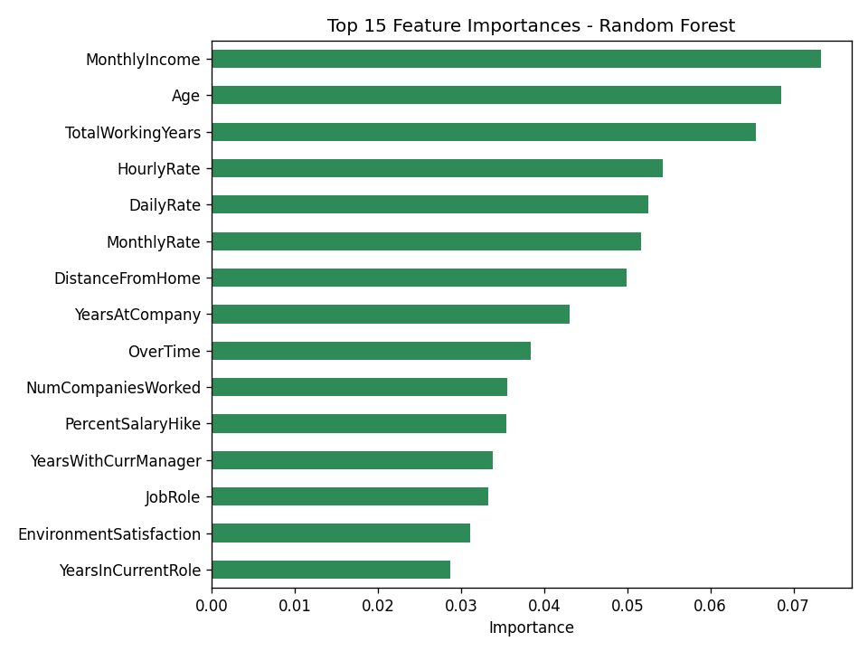

# Assignment 5: Employee Attrition Prediction — Decision Tree vs. Random Forest

## 🎯 Objective

A company wants to identify employees who are likely to leave the organization based on their demographic, professional, and work-related attributes. This project develops both a **Decision Tree** and a **Random Forest** classification model to predict employee attrition, and compares their performance.

## 📊 Dataset

**IBM HR Analytics Employee Attrition & Performance Dataset**

- **Kaggle Link:** https://www.kaggle.com/datasets/pavansubhasht/ibm-hr-analytics-attrition-dataset
- **Size:** 1,470 rows × 35 columns (31 columns after removing non-predictive columns)
- **Target Variable:** `Attrition` (`Yes` = employee left, `No` = employee stayed)

> ⚠️ The dataset is **not** included in this repository due to licensing restrictions. Download `WA_Fn-UseC_-HR-Employee-Attrition.csv` from the Kaggle link above and place it in the same folder as the notebook before running it.

## 📚 Libraries Used

| Library | Purpose |
|---|---|
| pandas | Data loading and manipulation |
| numpy | Numerical operations |
| matplotlib | Visualization (confusion matrices, feature importance) |
| scikit-learn | `LabelEncoder`, `DecisionTreeClassifier`, `RandomForestClassifier`, train/test split, evaluation metrics |

## 🔬 Methodology

1. **Data Understanding** — Loaded the dataset with Pandas, displayed the first five records, identified 8 categorical features, 26 numerical features, and `Attrition` as the target variable, and reviewed dataset info and summary statistics.
2. **Data Preprocessing** —
   - Checked for missing values (none found).
   - Removed 4 non-predictive columns: `EmployeeNumber` (unique ID), and `EmployeeCount`, `StandardHours`, `Over18` (constant for every row).
   - Encoded all categorical variables, including the target, with `LabelEncoder`.
   - Split the data into **80% training / 20% testing** (stratified on the target, since attrition is imbalanced — ~84% "No" vs. ~16% "Yes").
3. **Model Development** —
   - **Model 1:** `DecisionTreeClassifier` trained on the training set.
   - **Model 2:** `RandomForestClassifier` with **100 estimators** trained on the same training set.
   - Both models predicted attrition on the same held-out test set.
4. **Model Evaluation** — Evaluated both models with Accuracy, Precision, Recall, and F1-Score, generated a Confusion Matrix for each, and plotted Feature Importance for the Random Forest model.

## 📈 Results

| Metric | Decision Tree | Random Forest (100 trees) |
|---|---|---|
| **Accuracy** | 78.23% | 84.35% |
| **Precision (Attrition = Yes)** | 0.3191 | 0.5455 |
| **Recall (Attrition = Yes)** | 0.3191 | 0.1277 |
| **F1-Score (Attrition = Yes)** | 0.3191 | 0.2069 |

**Confusion Matrices (test set, n = 294):**

*Decision Tree*

| | Predicted: No | Predicted: Yes |
|---|---|---|
| **Actual: No** | 215 (TN) | 32 (FP) |
| **Actual: Yes** | 32 (FN) | 15 (TP) |

*Random Forest*

| | Predicted: No | Predicted: Yes |
|---|---|---|
| **Actual: No** | 242 (TN) | 5 (FP) |
| **Actual: Yes** | 41 (FN) | 6 (TP) |



**Feature Importance (Random Forest):**



## 🔍 Model Comparison

- **Accuracy:** Random Forest clearly outperforms the Decision Tree overall (84.35% vs. 78.23%), consistent with ensembles reducing the variance and overfitting a single tree is prone to.
- **The key trade-off — precision vs. recall on the minority class:** Random Forest has *higher precision* (0.55 vs. 0.32) but *lower recall* (0.13 vs. 0.32) on "Attrition = Yes" than the Decision Tree. In other words, Random Forest raises fewer false alarms, but it also misses more employees who actually left (41 false negatives vs. 32). The Decision Tree, despite lower overall accuracy, catches more true attrition cases.
- **Business implication:** Since missing an at-risk employee is usually costlier than a false alarm, recall on the "Yes" class often matters more than headline accuracy for this problem — a good reminder that accuracy alone can be misleading on imbalanced data (~84% "No" vs. ~16% "Yes").
- **Feature importance:** According to the Random Forest, `MonthlyIncome`, `Age`, `TotalWorkingYears`, `HourlyRate`, and `DailyRate` are the most influential predictors of attrition, along with `DistanceFromHome`, `YearsAtCompany`, and `OverTime` — broadly consistent with compensation, tenure, and work-life factors driving whether an employee stays or leaves.

## 🏁 Conclusion

Comparing the two models on the test set, Random Forest achieved higher overall accuracy and precision than the Decision Tree, but the Decision Tree achieved higher recall on the minority "Attrition = Yes" class — it identified more employees who genuinely left, while Random Forest was more conservative and missed more of them despite its higher accuracy. Which model "performed better" depends on the goal: Random Forest for overall reliability, Decision Tree for catching more at-risk employees.

Random Forest often outperforms a single Decision Tree because it is an ensemble: it trains many trees on bootstrapped samples and random feature subsets, then averages their predictions, reducing the variance and overfitting a single deep tree is prone to.

A key limitation of Decision Trees is sensitivity to the training data — small changes can produce a very different tree, and unconstrained trees easily overfit by memorizing noise instead of general patterns.

A key limitation of Random Forest is reduced interpretability, and, as seen here, a tendency on imbalanced data to favor the majority class for accuracy's sake, hurting recall on the minority class that often matters most in practice.

## 📁 Repository Structure

```
Assignment 5/
├── Assignment-5.ipynb        # Complete notebook (Tasks 1–5, with outputs)
├── confusion_matrices.png    # Confusion matrices for both models
├── feature_importance.png    # Random Forest feature importance plot
└── README.md                 # This file
```

## ▶️ How to Run

1. Download the dataset from [Kaggle](https://www.kaggle.com/datasets/pavansubhasht/ibm-hr-analytics-attrition-dataset) and place `WA_Fn-UseC_-HR-Employee-Attrition.csv` next to the notebook.
2. Install dependencies: `pip install pandas numpy matplotlib scikit-learn`
3. Open and run `Assignment-5.ipynb` in Jupyter.

---

*Submitted by: Ayush (23MIP10135), VIT Bhopal*
