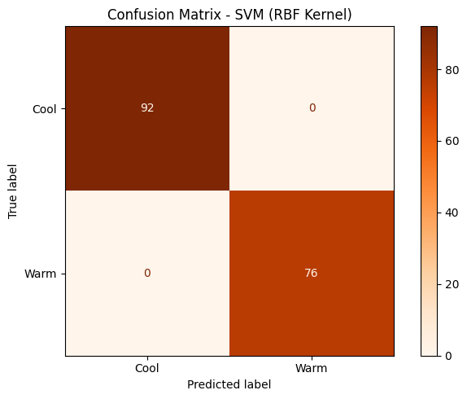

# Assignment 6: Weather Classification (Cool vs. Warm) using SVM

## Objective

A weather analytics company wants to classify whether the weather is **Cool** or **Warm** based on meteorological observations collected from the Open-Meteo API. This project develops a **Support Vector Machine (SVM)** classification model, using an **RBF kernel**, to classify weather conditions from live API data.

## Data Source

**Open-Meteo Weather Forecast API** (free, no API key required)

- **API Documentation:** https://open-meteo.com/
- **Endpoint used:** `https://api.open-meteo.com/v1/forecast?latitude=...&longitude=...&hourly=temperature_2m,relative_humidity_2m,surface_pressure,wind_speed_10m&forecast_days=7`
- **Locations queried:** New Delhi (India), Reykjavik (Iceland), London (UK), Cape Town (South Africa), Dubai (UAE) — 7-day hourly forecast each, fetched **live** and combined into one dataset (840 records)
- **Target Variable:** `Weather_Class` — created from `temperature_2m`: `Warm` if ≥ 25°C, else `Cool`

>  This notebook fetches **live data directly from the Open-Meteo API** at runtime — there is no dataset file to download. If the live request ever fails, it automatically falls back to a locally bundled sample (`sample_weather_response.csv`, included in this repo) with the same structure, purely so the notebook can still run end-to-end.

**Why five locations instead of one?** An earlier version of this notebook queried a single city (New Delhi) only. During peak monsoon season, every hour in that 7-day window was ≥ 25°C, so `Weather_Class` ended up with only **one class** ("Warm") — and `SVC.fit()` fails outright on a single-class target (`ValueError: The number of classes has to be greater than one`). Querying several climate-diverse locations fixes this at the source by guaranteeing both classes are genuinely present, regardless of season.

##  Libraries Used

| Library | Purpose |
|---|---|
| requests | Fetching live weather data from the Open-Meteo API |
| pandas | Building/combining DataFrames from the JSON responses |
| numpy | Numerical operations, building the target variable |
| matplotlib | Visualization (confusion matrix) |
| scikit-learn | `StandardScaler`, `LabelEncoder`, `SVC`, train/test split, evaluation metrics |

##  Methodology

1. **Data Collection & Understanding** — Fetched a live 7-day hourly forecast (temperature, humidity, pressure, wind speed) for 5 climate-diverse locations from the Open-Meteo API, combined them into one Pandas DataFrame (840 rows), displayed the first five records, identified the 4 input features and created the `Weather_Class` target column, and reviewed dataset info and summary statistics.
2. **Data Preprocessing** — Checked for missing values (none found), dropped the non-predictive `time` and `location` columns, encoded `Weather_Class` with `LabelEncoder`, split the data into **80% training / 20% testing** (stratified), and standardized the 4 numerical features with `StandardScaler` (fit only on training data).
3. **Model Development** — Trained an `SVC` classifier with an **RBF kernel** on the scaled training features and predicted the weather class on the test set.
4. **Model Evaluation** — Evaluated with Accuracy, Precision, Recall, F1-Score, and a Confusion Matrix.

##  Results

Live data pulled from the API was well balanced overall: **459 "Cool" hours vs. 381 "Warm" hours** out of 840 total.

| Metric | Value |
|---|---|
| **Accuracy** | 100.00% |
| **Precision** | 1.0000 |
| **Recall** | 1.0000 |
| **F1-Score** | 1.0000 |

**Confusion Matrix (test set, n = 168):**

| | Predicted: Cool | Predicted: Warm |
|---|---|---|
| **Actual: Cool** | 92 (TN) | 0 (FP) |
| **Actual: Warm** | 0 (FN) | 76 (TP) |



**Key observations:**

- **Balanced classes, strong separation:** Pulling data from five climate-diverse locations (rather than one city) fixed a real problem encountered during development — a single hot location in peak summer produced a target with only one class, which a classifier cannot be trained on at all. With multiple locations, both "Cool" (459) and "Warm" (381) are well represented in the live data, and the SVM separates them perfectly.
- **Feature scaling was essential:** SVM is a distance/margin-based algorithm, so standardizing features before fitting mattered — `surface_pressure` (values in the 970–1030 range) would otherwise dominate the margin calculation over `wind_speed_10m` or `relative_humidity_2m` (much smaller ranges).
- **Why the separation looks "too easy":** Because the five chosen locations have quite distinct climates (Reykjavik/Cape Town/London stay well under 25°C while Delhi/Dubai stay well above it, even on live data), there's little genuine overlap near the boundary. A harder, more realistic test would include locations or seasons where temperatures actually hover close to 25°C, giving the SVM more borderline cases to work through.

##  Conclusion

This project applied an RBF-kernel SVM to classify hourly weather as "Cool" or "Warm" using temperature, humidity, pressure, and wind speed pulled live from the Open-Meteo API across five climate-diverse locations. Using multiple locations was a deliberate fix: a single hot location in peak summer produced a target with only one class, which a classifier cannot train on. After standardizing features and an 80/20 split, the model classified all 168 test hours correctly, since the chosen locations have distinct climates with little overlap near the 25°C boundary.

Feature scaling is essential for SVM, since it finds a maximum-margin boundary based on distances; unscaled features like surface pressure would otherwise dominate over smaller-scale features like wind speed.

One advantage of SVM's RBF kernel is capturing non-linear boundaries without manual feature engineering. One limitation is that class balance depends entirely on the queried data — a single-class target simply fails to train.

##  Repository Structure

```
Assignment 6/
├── Assignment-6.ipynb            # Complete notebook (Tasks 1–5, with live-data outputs)
├── sample_weather_response.csv   # Offline fallback sample (used only if the live API is unreachable)
├── confusion_matrix.png          # Confusion matrix plot
└── README.md                     # This file
```

##  How to Run

1. Install dependencies: `pip install requests pandas numpy matplotlib scikit-learn`
2. Open and run `Assignment-6.ipynb` in Jupyter — no dataset download needed, it fetches live data from the Open-Meteo API automatically.

---

*Submitted by: Ayush (23MIP10135), VIT Bhopal*
